# Web Application Backend

## Simple Kanban App

### Description

This Kanban App is a simple web application that implements the REST API concept as well as the MVC concept. This Kanban App can be used to create a task and can also group the task into several parts.

Existing features from the Rest API and web view (_template_) are as follows:

- Register user
- Login user
- Logout
- Create Category
- Delete Category
- Create Task
- Update Task
- Delete Task
- Move Task (from one category to another)

### Constraints

There are several constraints in this web application, namely:

- This application does not use any framework.
- There are 2 different applications, namely web applications and REST API applications.
- This application only uses PostgreSQL database.

## Screenshots Application

- Index 
  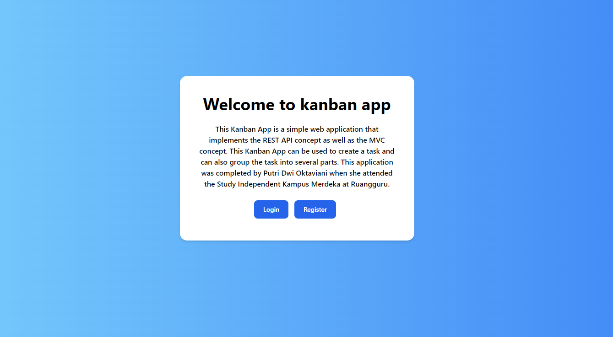

- Register user
  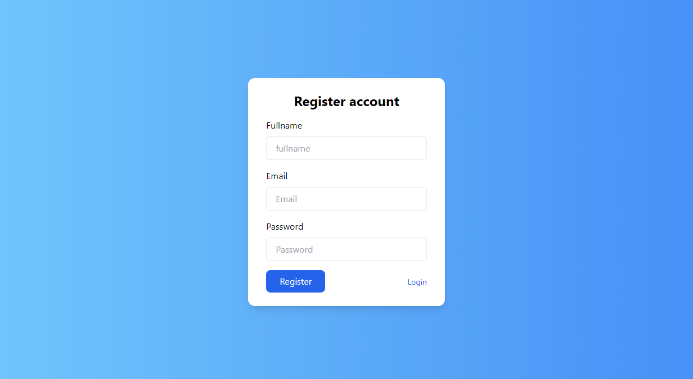

 - Login user
  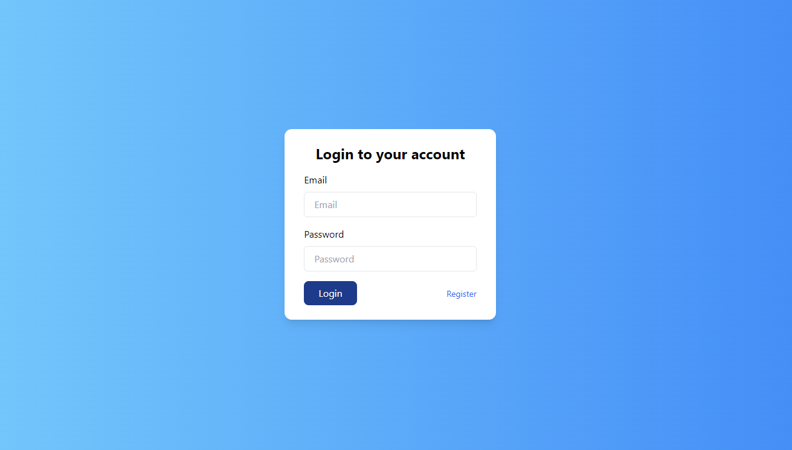

- Dashboard
  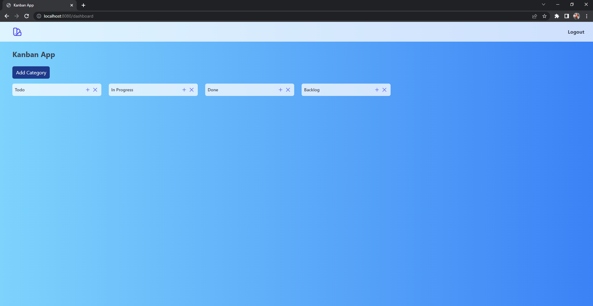

 - Create Category (Kategori)
  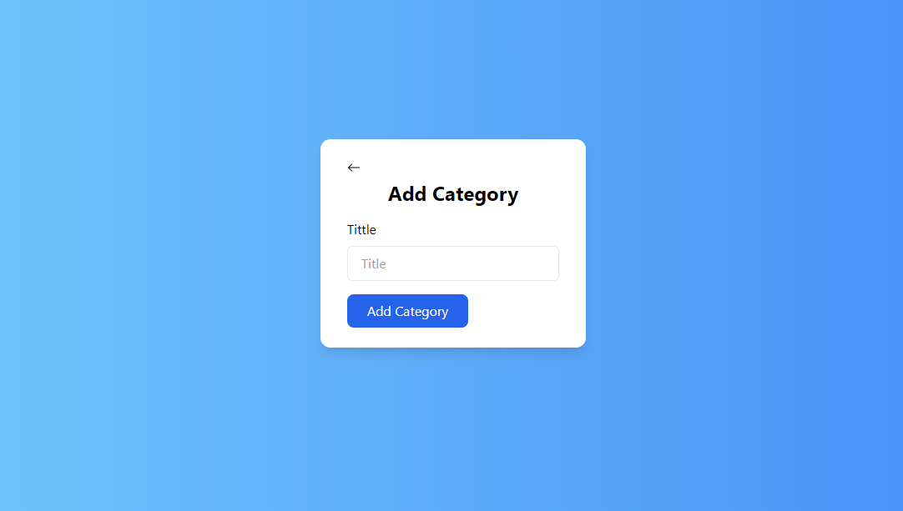

- Create Task (tugas)
  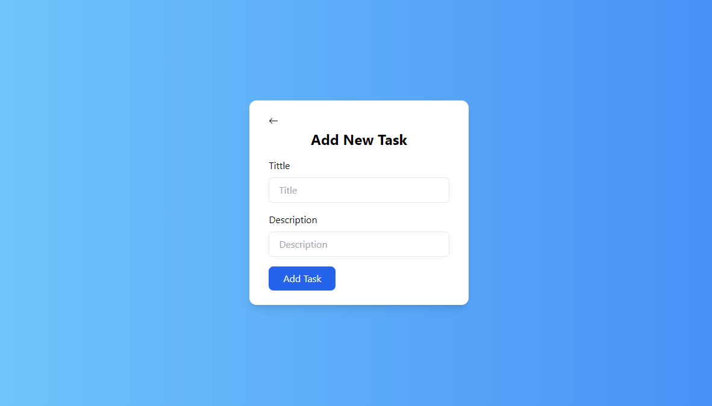

- Update Task
  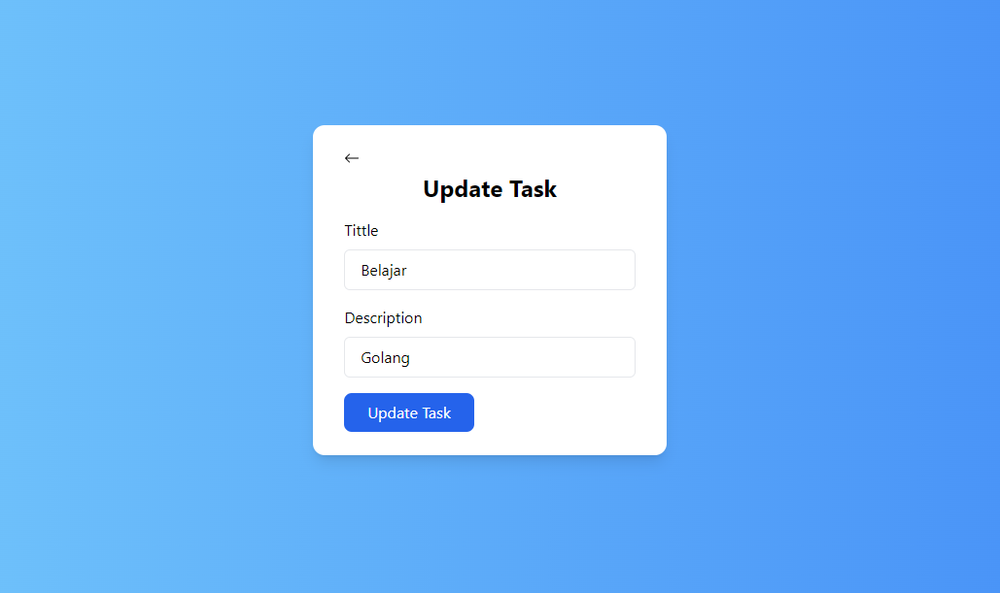

- Delete Task
- Delete Category
  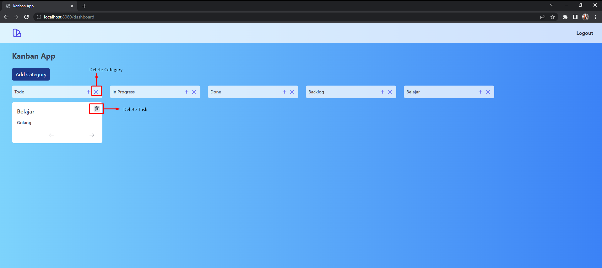

- Move Task (dari satu kategori ke kategori lain)
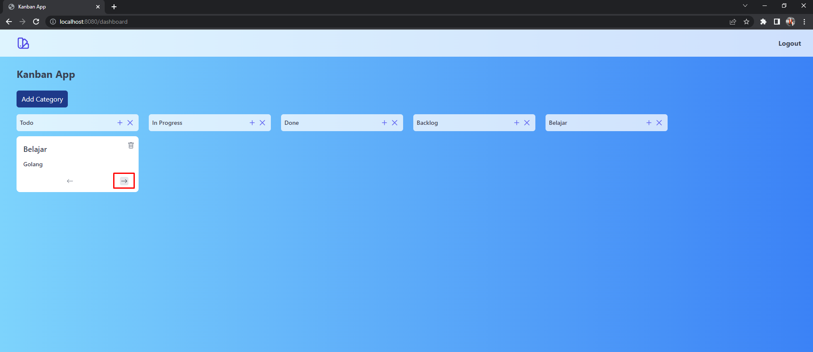
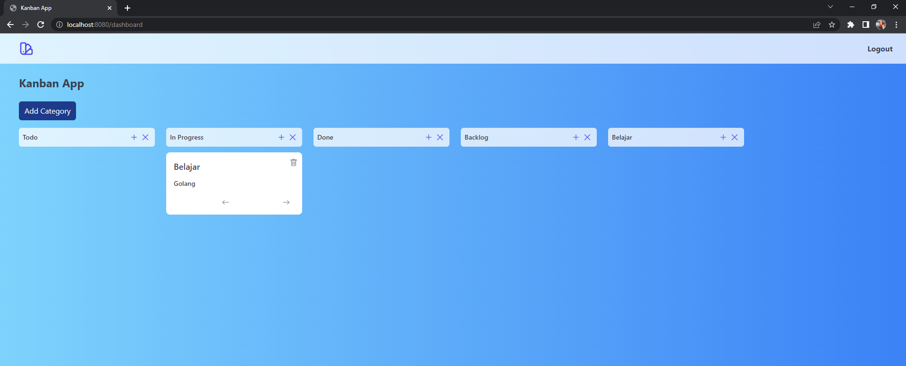

- Logout
  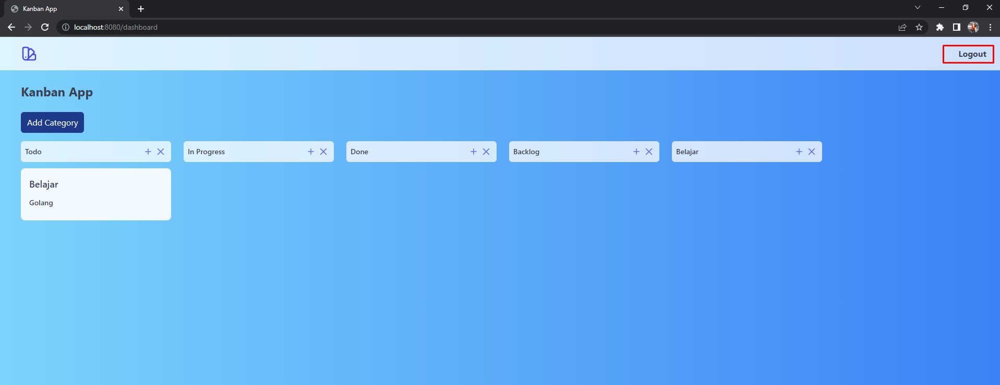